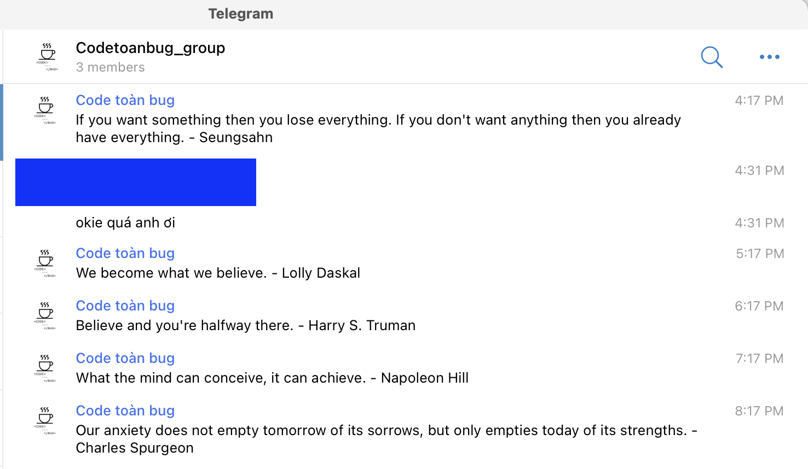

# telegram-random-quotes

## About
How it work:



## Get telegram-bot 
```bash
https://telegram.me/BotFather
```
## build
```bash
GOOS=linux GOARCH=amd64 go build <your parth of project>/cronJobProject/cronjob.go
```
## upload to host:
```bash
scp cronjob root@your_ipaddress:/usr/local/src/telegram-bot/
```
## create service:
```bash
vi /etc/systemd/system/telegram_bot.service
```

then add code:
```bash
[Unit]
Description=Telegram-bot  service
After=multi-user.target

[Service]
User=root
Group=root
Type=simple
Restart=always
RestartSec=5s
ExecStart=/usr/local/src/telegram-bot/cronjob

[Install]
WantedBy=multi-user.target
```

## run
```bash
sudo systemctl start telegram_bot.service
sudo systemctl enable telegram_bot.service
sudo systemctl status telegram_bot.service
```

# LICENSE
This project under [MIT license](https://github.com/lexuanquynh/telegram-random-quotes/blob/main/LICENSE). 
You're free to use it.
